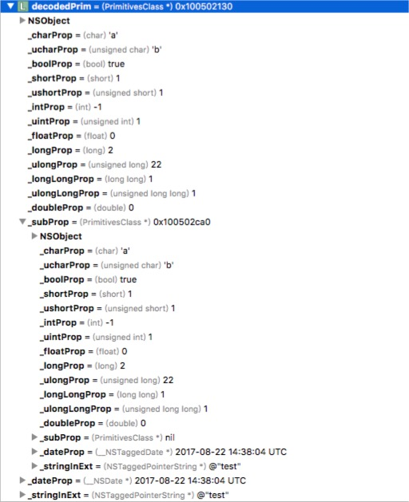

# NSObjectCodecHelper
This is a codec system for encoding any OC objects into a dictionary and JSON written with runtime features. In addition, it can decode a give JSON string to a specific class if that JSON string is encoded by it.

# Install
## Source
You can download the project and add `NSObject+CodecHelper.h/.m` files into your project and it's done.

# Usage
## Encoding
### NSObject to NSDictionary
The NSObjectCodecHelper is rather small, which only has two files. And it implements several categories. I'll put its methods here and list some example to explain how it works.  

```objc
@interface NSObject (CodecHelper)

- (NSDictionary *)encodeToDictionary;

@end
```

The main encoding method is written in an NSObject category, which has an `- (NSDictionary *)encodeToDictionary;` to encode a given object to a specific dictionary. I wrote a class called `PrimitivesClass` as an example before. 

```objc
@interface PrimitivesClass : NSObject

@property (nonatomic, assign)int intProp;
@property (nonatomic, assign)unsigned int uintProp;
@property (nonatomic, assign)long longProp;
@property (nonatomic, assign)unsigned long ulongProp;
@property (nonatomic, assign)short shortProp;
@property (nonatomic, assign)unsigned short ushortProp;
@property (nonatomic, assign)long long longLongProp;
@property (nonatomic, assign)unsigned long long ulongLongProp;
@property (nonatomic, assign)char charProp;
@property (nonatomic, assign)unsigned char ucharProp;
@property (nonatomic, assign)bool boolProp;
@property (nonatomic, assign)float floatProp;
@property (nonatomic, assign)double doubleProp;
@property (nonatomic, strong)PrimitivesClass *subProp;
@property (nonatomic, strong)NSDate *dateProp;

//etc

@end
```

In its header, it has lots of properties, which are mainly primitives of C language. And because of `NSObjectCodecHelper` is using ivar_list of a objective-c class to do the encoding work, the properties or ivars in the class' extension(private) is capable of being encoded into the dictionary.

After encoding, you can see results like below:

```objc
PrimitivesClass *prim = [[PrimitivesClass alloc] initWithInitialVals];
[prim createRecursiveIvar];
   
NSDictionary *encodedPrim = [prim encodeToDictionary];
NSLog(@"encodedDictionary:\n %@", encodedPrim);

/* Output:
encodedDictionary:
 {
    "Turtle.CodecHelper.__class_name_key" = PrimitivesClass;
    "_boolProp" = 1;
    "_charProp" = 97;
    "_dateProp" = "1503411592.38971";
    "_doubleProp" = 0;
    "_floatProp" = 0;
    "_intProp" = "-1";
    "_longLongProp" = 1;
    "_longProp" = 2;
    "_shortProp" = 1;
    "_stringInExt" = test;
    "_subProp" =     {
        "Turtle.CodecHelper.__class_name_key" = PrimitivesClass;
        "_boolProp" = 1;
        "_charProp" = 97;
        "_dateProp" = "1503411592.389745";
        "_doubleProp" = 0;
        "_floatProp" = 0;
        "_intProp" = "-1";
        "_longLongProp" = 1;
        "_longProp" = 2;
        "_shortProp" = 1;
        "_stringInExt" = test;
        "_ucharProp" = 98;
        "_uintProp" = 1;
        "_ulongLongProp" = 1;
        "_ulongProp" = 22;
        "_ushortProp" = 1;
    };
    "_ucharProp" = 98;
    "_uintProp" = 1;
    "_ulongLongProp" = 1;
    "_ulongProp" = 22;
    "_ushortProp" = 1;
}
*/
```

`NSObjectCodecHelper` is currently supporting all of the primitive types of C. But what comes sadly is that this tool is not supporting a class containing any struct value so far.

### NSDictionary to JSON String
This is rather easy, simply using `- (NSString *)encodeToJSONString;` of the `NSDictionary` category can do the tricks.  

## Decoding
### JSON String to NSDictionary
Using `- (NSDictionary *)jsonDecodeToDictionary;` method of the `NSString` category will make it.

### NSDictionary to a Specific kind of Object
Use `- (instancetype)codecObjectDecode;` method of the `NSDictionary` category can decode a dictionary to a specific kind of object if it can.  
  
For example, I will use the `encodedPrim` dictionary constructed before to decode back to a `PrimitivesClass` object now.  

```objc
PrimitivesClass *decodedPrim = (PrimitivesClass *)[encodedPrim codecObjectDecode];
NSLog(@"decodedPrim%@", decodedPrim);

/* Output:
decodedPrim:
 <PrimitivesClass: 0x100502130>
*/
```
And the decoded object's data is perfectly settled.



#License
This Project is using MIT license by now.

